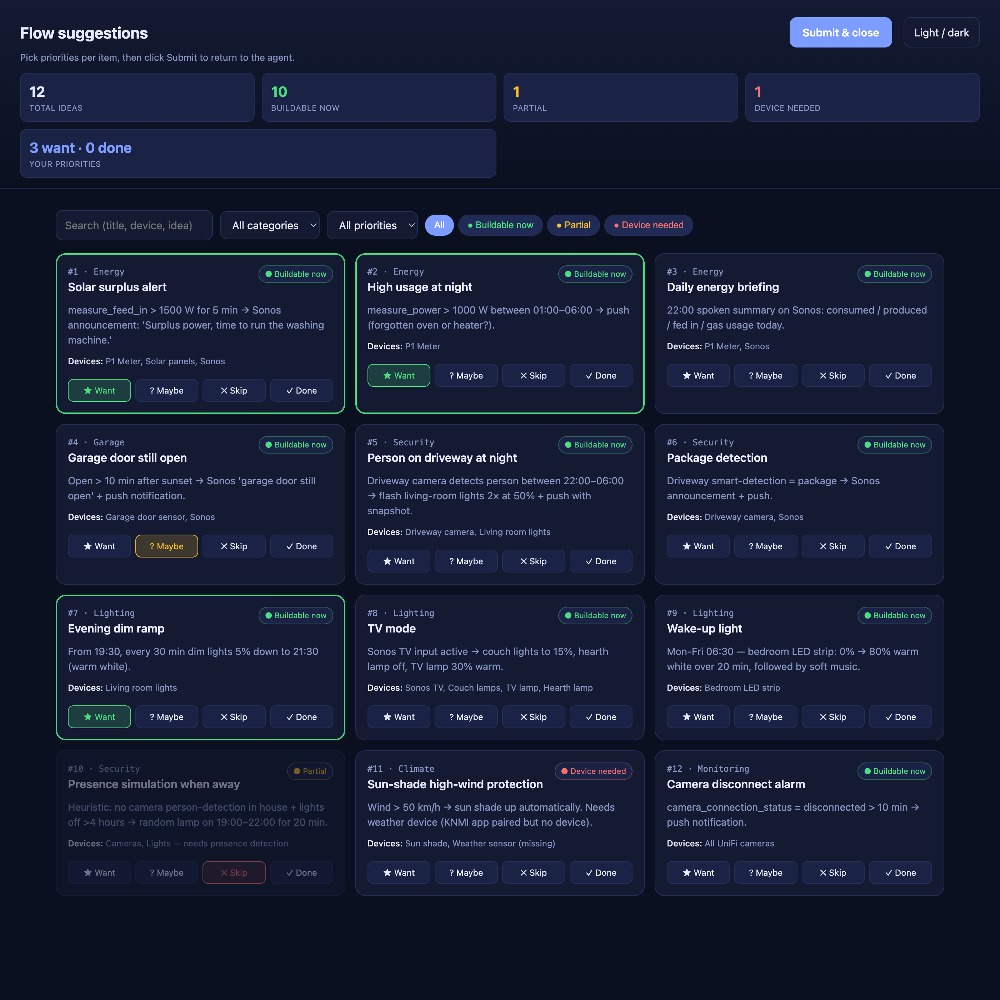

# homey-cli skill

A Claude Code / agent skill for driving a **Homey Pro** smart-home hub through the official `homey` CLI (`homey api <manager> <op>`). Replaces the public `mcp__claude_ai_Homey__*` MCP and adds full advanced-flow JSON support, app inventory, device settings, and ~50 API managers.

## Features

- 📖 **Read everything**: devices, zones, flows, apps, moods, alarms, insights, system info (~50 managers)
- 🔍 **Discover flow cards** per installed app, every trigger / condition / action with full `args` schema
- 🧩 **Build standard flows**: trigger + AND/OR condition groups + then/else actions
- 🕸️ **Build advanced flows**: full graph editor with 8 card types (`trigger`, `condition`, `action`, `start`, `delay`, `all`, `any`, `note`)
- 🎛️ **Control devices**: turn on/off, dim, set thermostat, set lock, set mood, rename, move zones
- 🚀 **Trigger flows** on demand, standard and advanced
- 📦 **Manage apps**: enable, disable, restart, list versions
- 🛠️ **Raw API escape hatch**: POST / PUT / DELETE against any manager endpoint
- 📜 **HomeyScript fallback** for logic flows can't express, with a decision tree on when to use
- 🌐 **Token-mode (LAN)**: bypass cloud and hit the Homey directly over the local network
- 🗂️ **Templates included**: 4 flow skeletons + 8 card primitives + 3 HomeyScript starters
- ✅ **10-point validation checklist** before every flow push
- 🛡️ **Guardrails**: risk tiers, active-Homey check, `broken: false` distrust, backup-before-update
- 🔁 **Drop-in MCP replacement**: all 19 public `mcp__claude_ai_Homey__*` tools have a CLI equivalent
- 💡 **Flow suggestions**: ask *"suggest flows"* / *"wat kan ik automatiseren"* — the agent generates ideas from your device inventory and shows them in a browser picker (filters, status tags, want/maybe/skip/done) or terminal multi-select; agent auto-continues on submit and can build the picked flows next

See [What the skill can do](#what-the-skill-can-do) below for the long version.

## Install as a Claude Code skill

Claude Code auto-loads any folder matching `<skill-name>/SKILL.md` under one of:

- `~/.claude/skills/<skill-name>/`: available in every project (recommended for personal use)
- `<project>/.claude/skills/<skill-name>/`: available only in that project

The folder name **must** be `homey-cli` (matches the `name:` in `SKILL.md` frontmatter).

### Option A: user-level (recommended, all projects)

Clone straight into your global Claude Code skills folder:

```bash
mkdir -p ~/.claude/skills
git clone https://github.com/timvdhoorn/homey-cli-skill.git ~/.claude/skills/homey-cli
```

Done. Restart Claude Code and the skill is available everywhere.

### Option B: project-level (single project)

```bash
mkdir -p /path/to/project/.claude/skills
git clone https://github.com/timvdhoorn/homey-cli-skill.git /path/to/project/.claude/skills/homey-cli
```

### Option C: clone elsewhere + symlink (advanced)

If you want to keep one working copy and link it into multiple locations (e.g. you're hacking on the skill yourself):

```bash
git clone https://github.com/timvdhoorn/homey-cli-skill.git ~/src/homey-cli-skill
ln -s ~/src/homey-cli-skill ~/.claude/skills/homey-cli
```

### Verify it loaded

Start a new Claude Code session and ask something like:

> List my Homey devices.

Claude Code will invoke the `homey-cli` skill automatically. You can also force-invoke via `Skill(skill: "homey-cli")` or `/skills` if your build exposes that.

### Updating

```bash
cd ~/.claude/skills/homey-cli && git pull
```

(or `cd` to wherever you cloned it for Option C).

## Prerequisites

```bash
npm install -g homey            # or: bun add -g homey
homey --version                  # expect 4.x+
homey login                      # browser OAuth with Athom
homey select --id <HOMEY_ID>     # non-interactive selection
homey select current             # verify
```

## What the skill can do

Six capabilities, grouped by risk tier (Safe / Medium / High):

### 1. Read state (Safe)
- List **devices** with id, name, zone, class, capabilities, available status.
- List **zones** with parent/child relations.
- List **flows** (standard + advanced) with enabled/broken status.
- List **apps** with version + author.
- List **moods** (light scenes).
- List **alarms**, **users**, **insights/logs**, **notifications**, **geolocation**, **system info**, **backups**.
- ~50 managers reachable via `homey api <manager> get-*`; full index in `references/managers-cheatsheet.md`.

### 2. Discover card capabilities (Safe)
- Enumerate **every flow card** (triggers / conditions / actions) of every installed app, including `id`, `args` schema, expected `droptoken`, emitted `tokens`.
- Filter by app (`select(.ownerUri | startswith("homey:app:com.sonos"))`) or by keyword in title.
- 12 argument types covered (device, autocomplete, dropdown, number, range, color, datetime, etc.), see `references/flow-cards.md`.

### 3. Build & modify flows (High)
- **Standard flows**: single trigger, AND/OR condition groups, then/else actions, optional delay + duration on each action.
- **Advanced flows**: graph-based with 8 card types: `trigger`, `condition`, `action`, `start`, `delay`, `all`, `any`, `note`.
- 8-step workflow from intent → discovery → JSON composition → validation → push → verify.
- 10-point validation checklist before every push.
- 4 ready-to-customize flow templates + 8 single-card primitives in `assets/flow-templates/`.
- Canvas-coordinate calibration so cards don't overlap in the editor.
- Round-trip edit pattern: backup → edit → push → verify with diff.

### 4. Control state (Medium)
- **Set capability values**: turn lights on/off, set dim, set thermostat, set lock, etc. (`set-capability-value`).
- **Trigger flows**: standard and advanced (`trigger-flow` / `trigger-advanced-flow`).
- **Set a mood** (light scene).
- **Rename / move devices** between zones (`update-device`).
- **Enable / disable / restart apps**.
- **Set device settings** (per-driver settings dict).
- Bulk operations via loops; example in `references/recipes.md`.

### 5. Escape hatches
- **Raw API**: hit any of the ~50 manager endpoints directly (`homey api raw -X POST --path ...`).
- **HomeyScript**: JS that runs server-side on Homey, for logic flows can't express. Decision tree in `references/homeyscript.md` gates appropriateness; 3 templates included.
- **Token-mode**: bypass cloud and hit the Homey directly over LAN with a bearer token.

### 6. Flow suggestions (Safe)
- Surface flow ideas and let you pick which to build. Three sources:
  - **Agent-generated** — say *"suggest flows"* / *"wat kan ik automatiseren"* and the agent generates ideas from your device inventory + existing flows.
  - `wishlist.json` in your project — structured items the agent reads directly.
  - `WISHLIST.md` in your project — light markdown convention (`## Category` + `- **Title** — desc`).
- **Browser mode**: rich UI (filters per category/status, search, want/maybe/skip/done per item) served via the `superpowers:brainstorming` visual-companion server. Best for ≥6 items or thorough triage.
- **Terminal mode**: `AskUserQuestion` with `multiSelect` directly in chat. No browser, no server. Best for ≤6 items or quick passes.
- **Auto-continue**: after submit the agent picks up the selection without you typing in terminal (fallback: just tell the agent you submitted).
- **Follow-through**: agent's natural next step is to build the picked flows via Capability 3 (one at a time, with confirmation).
- Triggers, inventory query patterns, JSON schema, markdown parsing, event contract: `references/flow-suggestions.md`.



### What it replaces

This skill is a superset of the public `mcp__claude_ai_Homey__*` MCP. All 19 MCP tools have a CLI equivalent (mapping in `references/mcp-migration.md`). Beyond the MCP: advanced-flow JSON support, app inventory with versions, device settings, raw API, HomeyScript management.

### Guardrails baked in

- **Active-Homey discipline**: explicit `homey select current` confirmation before every state change, to avoid accidentally targeting a family member's Homey.
- **Risk tiers**: every operation classified Safe / Medium / High, with required steps per tier.
- **`broken: false` distrust**: flows can reference deleted devices/zones and still report healthy; post-push verification re-resolves every ref.
- **Backup-before-update**: `update-*-flow` is PUT not PATCH; templates always back up first.
- **Non-interactive flags**: agent contexts have no stdin; skill documents which commands hang and how to avoid them.

## Layout

```
SKILL.md                            # skill body, entry point
references/
  managers-cheatsheet.md            # per-manager command index
  flow-cards.md                     # card taxonomy, 12 arg types, tokens
  flow-json-schema.md               # JSON shape + 10-point validation checklist
  homeyscript.md                    # fallback when flows can't express logic
  recipes.md                        # backup, audit, bulk ops
  pitfalls.md                       # active-Homey discipline, broken:false trap, etc.
  mcp-migration.md                  # 19-tool MCP → CLI mapping
  flow-suggestions.md               # flow-suggestions workflow (triggers, generation, browser + terminal modes)
assets/
  flow-templates/                   # 4 ready-to-customize flow skeletons
  flow-templates/card-primitives/   # 8 minimal card fragments
  homeyscript-templates/            # 3 minimal scripts
  wishlist-picker/template.html     # self-contained picker UI for browser mode
  wishlist-picker/screenshot.png    # README screenshot of the picker UI
```

## Contributing

Edits made in a project that symlinks this skill flow straight back here on disk, so commit and push from this directory.

## License

MIT.
